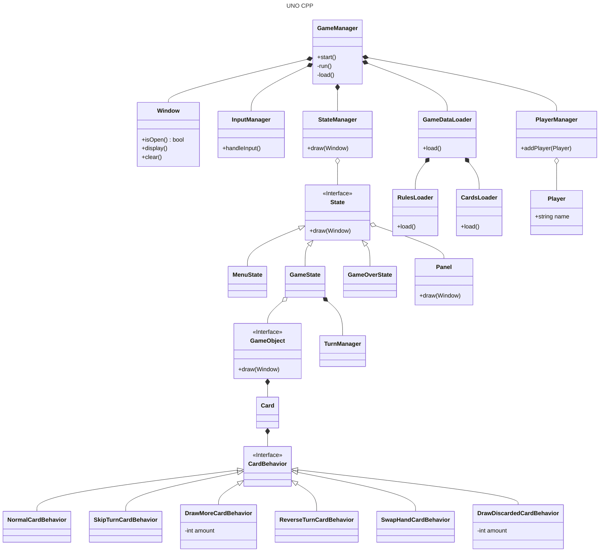

# simpleunocpp
A simple UNO game to train C++ programming.

```mermaid
---
title: UNO CPP
---
classDiagram

    class GameManager {
        +start()        
        -run()
        -load()
    }

    class Window {
        +isOpen() bool
        +display()
        +clear()
    }

    class InputManager {
        +handleInput()
    }

    class StateManager {
        +draw(Window)
    }

    class State {
        <<Interface>>
        +draw(Window)
    }

    class MenuState {
    }

    class GameState {
    }

    class GameOverState {
    }

    class GameDataLoader {
        +load()
    }

    class RulesLoader {
        +load()
    }

    class CardsLoader {
        +load()
    }

    class Panel {
        +draw(Window)
    }

    class GameObject {
        <<Interface>>
        +draw(Window)
    }

    class Card {
    }

    class Player {
        +string name
    }

    class PlayerManager {
        +addPlayer(Player)
    }

    class TurnManager {
    }

    class CardBehavior {
        <<Interface>>
    }

    class NormalCardBehavior {
    }

    class SkipTurnCardBehavior {
    }

    class DrawMoreCardBehavior {
        -int amount
    }

    class ReverseTurnCardBehavior {
    }

    class SwapHandCardBehavior {
    }

    class DrawDiscardedCardBehavior {
        -int amount
    }

    Card *-- CardBehavior

    CardBehavior <|-- NormalCardBehavior
    CardBehavior <|-- SkipTurnCardBehavior
    CardBehavior <|-- DrawMoreCardBehavior
    CardBehavior <|-- ReverseTurnCardBehavior
    CardBehavior <|-- SwapHandCardBehavior
    CardBehavior <|-- DrawDiscardedCardBehavior

    PlayerManager o-- Player

    GameObject *-- Card

    GameState o-- GameObject

    State o-- Panel

    GameDataLoader *-- RulesLoader
    GameDataLoader *-- CardsLoader

    GameManager *-- InputManager
    GameManager *-- Window
    GameManager *-- StateManager
    GameManager *-- GameDataLoader
    GameManager *-- PlayerManager

    StateManager o-- State

    State <|-- MenuState
    State <|-- GameState
    State <|-- GameOverState

    GameState *-- TurnManager

```
